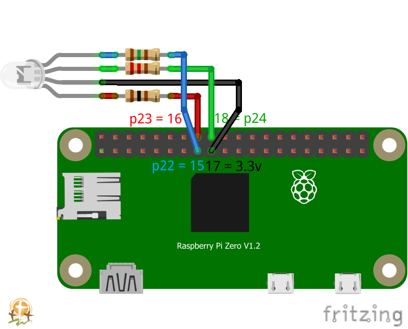

# OBS-Tally-py
Tally light for OBS source using rpi, rgb leds, and obs-websocket
Each pi will sit and look for a websocket connection. Once connected, 
it will light yellow when the provided source is in preview and green when its in program

### Installation
1. Install the watchgod and websockets library as root, used to run the script
    `sudo pip3 install watchgod`
    `sudo pip3 install websockets`

2. Install and Setup NGINX and PHP-Server 
https://www.raspberrypi.org/documentation/remote-access/web-server/nginx.md

(If using php 7, also install php-xml - `sudo apt install php-xml`)

3. Put index.php in /var/www/html/

4. In index.php change tally.xml-path to match the actual path (and make sure nginx can write to it)

5. Run index.php from a browser

6. Setup OBS-Tally Settings (IP, Password, Port from OBS-Websockets, Scenes and GPIO-Ports)

7. Connect LEDs to the matching GPIO

8. If you need to invert the outputs for no/nc relays, check the invert box in the webpage.

9. Start this script and nginx on boot:

    * `sudo update-rc.d -f nginx defaults;`
    * `sudo nano /etc/rc.local`
    * just above line 'exit 0' insert:
    * `(
            cd [/path/to/obs-tally]
            watchgod [/path/to/]obstally.main [/path/to/]tally.xml &
       )`

### Hardware
Follow the connection diagram below with a raspberry pi zero w:
[Adafruit](https://www.adafruit.com/product/3400)

and an rgb led:
[Adafruit](https://www.adafruit.com/product/848), 
[Amazon US](https://www.amazon.com/gp/product/B0194Y6MW2/)

Resistances:
Red - 100 ohm  
Green - 220 ohm  
Blue - 150 ohm